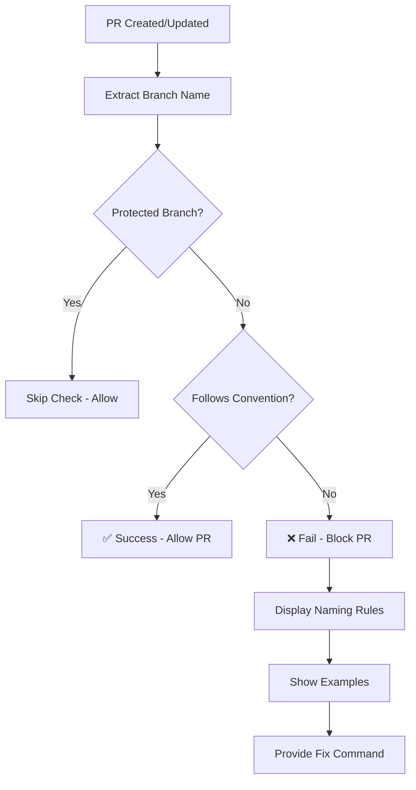

# Branch Naming Convention Workflow Guide

## What is the Branch Naming Convention Workflow?

The Branch Naming Convention workflow is a GitHub Actions automation that enforces consistent branch naming standards across the TaskManager-Server project. It automatically validates branch names when pull requests are created, ensuring all development follows established naming conventions.

## Why Use Branch Naming Conventions?

### Code Organization Benefits

- **Clarity**: Instantly understand the purpose of each branch
- **Consistency**: Uniform naming across all team members
- **Searchability**: Easy to find branches by type or purpose
- **Automation**: Enables automated workflows based on branch types

### Team Collaboration Benefits

- **Standardization**: Everyone follows the same naming rules
- **Code Reviews**: Reviewers can quickly understand branch purpose
- **Project Management**: Integration with issue tracking and project boards
- **Documentation**: Self-documenting branch history

### DevOps Integration Benefits

- **Automated Deployments**: Different deployment strategies per branch type
- **CI/CD Optimization**: Conditional workflows based on branch patterns
- **Environment Management**: Automatic environment assignments
- **Release Management**: Clear distinction between features, fixes, and releases

## When Does the Workflow Execute?

### Trigger Conditions

```yaml
on:
  pull_request:
    branches: ['dev', 'staging', 'main']
```

The workflow executes when:

- **Pull Request Events**: Created, updated, or synchronized
- **Target Branches**: PRs targeting `dev`, `staging`, or `main` branches
- **All PR Types**: Draft and ready-for-review pull requests

### Execution Timeline

- **Immediate**: Runs as soon as PR is created
- **On Updates**: Re-runs when PR is updated or branch is pushed
- **Blocking**: Must pass before PR can be merged (if branch protection is enabled)

## How the Branch Naming Workflow Works

### 1. Workflow Execution Flow



### 2. Branch Name Validation Logic

#### Step 1: Branch Name Extraction

```bash
branch_name="${{ github.head_ref }}"
```

- Extracts the source branch name from the pull request
- Uses GitHub's built-in context variable `github.head_ref`

#### Step 2: Protected Branch Check

```bash
if [[ $branch_name =~ ^(main|staging|dev)$ ]]; then
  echo "✅ Protected branch '$branch_name' - skipping naming convention check"
  exit 0
fi
```

- **Protected Branches**: `main`, `staging`, `dev`
- **Behavior**: Automatically passes validation
- **Rationale**: Core branches don't need prefix conventions

#### Step 3: Convention Validation

```bash
if [[ ! $branch_name =~ ^(feature|fix|hotfix|bugfix|chore|docs)/.+ ]]; then
  # Fail with detailed error message
  exit 1
fi
```

**Required Pattern**: `prefix/description`

**Allowed Prefixes**:

- `feature/` - New features and enhancements
- `fix/` - Bug fixes and corrections
- `hotfix/` - Critical production fixes
- `bugfix/` - Alternative bug fix prefix
- `chore/` - Maintenance tasks and updates
- `docs/` - Documentation changes

### 3. Error Handling and User Guidance

When validation fails, the workflow provides comprehensive guidance:

#### Error Message Structure

1. **Clear Identification**: Shows the invalid branch name
2. **Rule Explanation**: Lists all naming conventions
3. **Valid Examples**: Demonstrates correct naming patterns
4. **Invalid Examples**: Shows common mistakes
5. **Fix Command**: Provides exact command to rename branch

#### Example Error Output

```
❌ Branch name 'my-new-feature' does not follow naming convention!

📋 Branch Naming Rules:
✅ Protected branches (allowed): main, staging, dev
✅ Feature branches must use: feature/your-feature-name
✅ Bug fixes must use: fix/your-fix-name
✅ Allowed prefixes: feature/, fix/, hotfix/, bugfix/, chore/, docs/

🔧 To fix: Rename your branch using:
  git branch -m my-new-feature feature/my-new-feature
```

## Branch Naming Convention Standards

### 1. Feature Branches

```
feature/user-authentication
feature/payment_integration
feature/dashboard-redesign
feature/user_profile_update
```

**Purpose**: New functionality, enhancements, user stories
**Naming**: Descriptive, using hyphens or underscores, verb or noun phrases

### 2. Bug Fix Branches

```
fix/login-validation
fix/api-timeout-issue
bugfix/memory-leak-users
```

**Purpose**: Resolving bugs, errors, or issues
**Naming**: Describe the problem being fixed

### 3. Hotfix Branches

```
hotfix/security-vulnerability
hotfix/critical-api-bug
hotfix/production-crash
```

**Purpose**: Critical fixes that need immediate deployment
**Naming**: Emphasize urgency and criticality

### 4. Chore Branches

```
chore/update-dependencies
chore/refactor-auth-service
chore/cleanup-unused-code
```

**Purpose**: Maintenance, refactoring, dependency updates
**Naming**: Focus on the maintenance activity

### 5. Documentation Branches

```
docs/api-documentation
docs/deployment_guide
docs/architecture-overview
docs/kill_app_in_port
```

**Purpose**: Documentation updates, guides, README changes
**Naming**: Describe the documentation being updated

## Best Practices Implementation

### 1. Branch Naming Guidelines

#### Do's ✅

- Use lowercase letters with hyphens or underscores
- Be descriptive but concise
- Include issue numbers when applicable: `feature/auth-123`
- Use present tense verbs: `fix/update-user-profile`
- Group related work: `feature/payment-flow`
- Follow the `prefix/description` pattern

#### Don'ts ❌

- Use spaces in branch names
- Use CamelCase (PascalCase is also discouraged)
- Create overly long names (keep descriptions concise)
- Use ambiguous descriptions
- Mix different types of work in one branch
- Omit the required prefix (feature/, fix/, docs/, etc.)

### 2. Integration with Development Workflow

#### Git Flow Integration

```bash
# Feature development
git checkout dev
git checkout -b feature/new-user-dashboard
# ... development work ...
git push origin feature/new-user-dashboard
# Create PR: feature/new-user-dashboard → dev
```

#### Issue Tracking Integration

```bash
# Link branches to issues
feature/user-auth-issue-145
fix/api-bug-issue-200
docs/readme-update-issue-67
```

### 3. Automation Benefits

#### Conditional Workflows

```yaml
# Example: Deploy to staging only for feature branches
if: startsWith(github.head_ref, 'feature/')
```

#### Automated Labeling

```yaml
# Auto-label PRs based on branch prefix
- name: Label PR
  if: startsWith(github.head_ref, 'feature/')
  run: gh pr edit --add-label "enhancement"
```

## Configuration and Customization

### 1. Modifying Allowed Prefixes

To add new prefixes, update the regex pattern:

```bash
# Current pattern
^(feature|fix|hotfix|bugfix|chore|docs)/.+

# Example with additional prefixes
^(feature|fix|hotfix|bugfix|chore|docs|test|refactor)/.+
```

### 2. Adding Protected Branches

Update the protected branch check:

```bash
# Current protected branches
^(main|staging|dev)$

# Example with additional branches
^(main|staging|dev|release/.+)$
```

### 3. Custom Validation Rules

Example: Require issue numbers

```bash
# Require issue number in branch name
if [[ ! $branch_name =~ ^(feature|fix)/.+-issue-[0-9]+$ ]]; then
  echo "Branch must include issue number: feature/my-feature-issue-123"
  exit 1
fi
```

## Troubleshooting Common Issues

### 1. Branch Name Rejected

**Problem**: PR blocked due to naming convention
**Solution**:

```bash
# Rename the branch
git branch -m old-branch-name feature/new-branch-name
git push origin -u feature/new-branch-name
git push origin --delete old-branch-name
```

### 2. Protected Branch False Positive

**Problem**: Protected branch incorrectly flagged
**Solution**: Verify branch name exactly matches protected list

### 3. Workflow Not Running

**Problem**: Branch naming check doesn't execute
**Possible Causes**:

- PR targets wrong branch (must target dev/staging/main)
- Workflow file syntax error
- GitHub Actions disabled for repository

### 4. Regex Pattern Issues

**Problem**: Valid branch names rejected
**Solution**: Test regex pattern with branch names

```bash
# Test pattern locally
branch_name="feature/my-feature"
if [[ $branch_name =~ ^(feature|fix|hotfix|bugfix|chore|docs)/.+ ]]; then
  echo "Valid"
else
  echo "Invalid"
fi
```

## Integration with Branch Protection Rules

### 1. Required Status Checks

Configure branch protection to require this workflow:

```
Settings → Branches → Branch protection rules
☑ Require status checks to pass before merging
☑ Branch Naming Convention / Check Branch Name
```

### 2. Enforcement Levels

- **Advisory**: Workflow runs but doesn't block PRs
- **Required**: Must pass before merge is allowed
- **Strict**: Requires up-to-date branches

## Monitoring and Maintenance

### 1. Workflow Metrics

- **Success Rate**: Percentage of PRs passing naming convention
- **Common Violations**: Most frequent naming mistakes
- **Adoption Rate**: Team compliance with conventions

### 2. Regular Reviews

- **Quarterly**: Review naming conventions for relevance
- **On Team Growth**: Update conventions for new team members
- **Project Evolution**: Adapt conventions to project needs

### 3. Documentation Updates

- **Team Onboarding**: Include branch naming in developer guides
- **Process Documentation**: Keep naming standards documented
- **Example Updates**: Maintain current, relevant examples

## Conclusion

The Branch Naming Convention workflow is a crucial automation that maintains code organization and development standards in the TaskManager-Server project. By enforcing consistent naming patterns, it improves team collaboration, enables advanced automation, and maintains a clean, searchable development history.

Regular adherence to these conventions, combined with proper workflow configuration, ensures a smooth and organized development process for the entire team.
