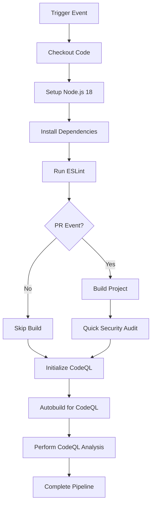

# CI Security Pipeline Workflow Guide

## What is the CI Security Pipeline?

The CI Security Pipeline is a comprehensive GitHub Actions workflow that combines continuous integration (CI) practices with security scanning for the TaskManager-Server project. It automatically runs code quality checks, builds, and security scans whenever code changes are made, ensuring both functionality and security standards are maintained.

## Why Use a CI Security Pipeline?

### Code Quality Assurance

- **Automated Linting**: Ensures consistent code style and catches common errors
- **Build Verification**: Confirms code compiles successfully before merge
- **Early Error Detection**: Identifies issues before they reach production
- **Consistent Standards**: Enforces coding standards across all contributors

### Security Benefits

- **Vulnerability Detection**: Identifies security issues in code and dependencies
- **Supply Chain Security**: Monitors dependencies for known vulnerabilities
- **Static Analysis**: Performs deep code analysis for security patterns
- **Compliance**: Helps meet security compliance requirements

### Development Workflow Benefits

- **Automated Feedback**: Immediate feedback on code changes
- **Quality Gates**: Prevents low-quality code from being merged
- **Developer Productivity**: Reduces manual testing and review overhead
- **Confidence**: Provides confidence in code changes through automated verification

## When Does the CI Security Pipeline Execute?

### Trigger Conditions

```yaml
on:
  pull_request:
    branches: ['dev']
    paths:
      - '**/*.ts'
      - '**/*.js'
      - '**/*.tsx'
      - '**/*.jsx'
      - 'package*.json'
      - 'prisma/**'
  push:
    branches: ['dev']
  schedule:
    - cron: '0 2 1 * *'
```

### Execution Scenarios

#### 1. Pull Request Events

- **Target Branch**: PRs targeting the `dev` branch
- **File Types**: Only when specific file types are changed:
  - TypeScript files (`*.ts`, `*.tsx`)
  - JavaScript files (`*.js`, `*.jsx`)
  - Package files (`package.json`, `package-lock.json`)
  - Database schema files (`prisma/**`)
- **Purpose**: Validate changes before merge

#### 2. Push Events

- **Target Branch**: Direct pushes to `dev` branch
- **All Files**: Runs regardless of file types changed
- **Purpose**: Continuous validation of main development branch

#### 3. Scheduled Events

- **Frequency**: Monthly (1st day of each month at 2:00 AM UTC)
- **Purpose**: Regular security scanning even without code changes
- **Rationale**: Complements Dependabot's weekly dependency updates

## How the CI Security Pipeline Works

### 1. Workflow Execution Flow



### 2. Step-by-Step Breakdown

#### Environment Setup

```yaml
runs-on: ubuntu-latest
timeout-minutes: 15
permissions:
  actions: read
  contents: read
  security-events: write
```

- **Runtime**: Ubuntu latest version
- **Timeout**: 15-minute limit to prevent hanging workflows
- **Permissions**: Minimal required permissions for security scanning

#### Code Checkout and Node.js Setup

```yaml
- name: Checkout repository
  uses: actions/checkout@v4

- name: Setup Node.js
  uses: actions/setup-node@v4
  with:
    node-version: '18'
    cache: 'npm'
```

- **Checkout**: Uses latest stable action version (v4)
- **Node.js**: Specifically version 18 for consistency
- **Caching**: npm cache enabled for faster builds

#### Dependency Installation

```yaml
- name: Install dependencies
  run: npm ci
```

- **npm ci**: Clean install using lock file for reproducible builds
- **Speed**: Faster than `npm install` in CI environments
- **Reliability**: Ensures exact dependency versions

#### Code Quality Check

```yaml
- name: Run ESLint
  run: npm run lint
```

- **ESLint**: Runs on all workflow triggers
- **Configuration**: Uses project's ESLint configuration
- **Blocking**: Workflow fails if linting errors are found

#### Build Verification (PR Only)

```yaml
- name: Build project
  if: github.event_name == 'pull_request'
  run: npm run build
```

- **Conditional**: Only runs on pull requests
- **Purpose**: Verifies code compiles successfully
- **Optimization**: Avoids redundant builds with CodeQL autobuild

#### Security Audit (PR Only)

```yaml
- name: Quick security audit
  if: github.event_name == 'pull_request'
  run: npm audit --audit-level=high
  continue-on-error: true
```

- **Conditional**: Only runs on pull requests
- **Audit Level**: High-severity vulnerabilities only
- **Non-blocking**: `continue-on-error: true` prevents workflow failure
- **Rationale**: Dependabot handles comprehensive dependency updates

#### CodeQL Security Analysis

```yaml
- name: Initialize CodeQL
  uses: github/codeql-action/init@v3
  with:
    languages: javascript

- name: Autobuild
  uses: github/codeql-action/autobuild@v3

- name: Perform CodeQL Analysis
  uses: github/codeql-action/analyze@v3
```

- **Language**: JavaScript/TypeScript analysis
- **Autobuild**: Automatic build process for CodeQL
- **Analysis**: Deep static analysis for security vulnerabilities

## Pipeline Components Deep Dive

### 1. ESLint Integration

#### Purpose

- Code style consistency
- Common error detection
- Best practice enforcement

#### Configuration

Uses project's ESLint configuration (`eslint.config.mjs`)

#### Impact

- **Blocking**: Workflow fails if linting errors exist
- **Immediate Feedback**: Developers get quick feedback on code quality

### 2. Build Verification

#### Purpose

- Ensure code compiles successfully
- Catch TypeScript compilation errors
- Validate build process

#### Optimization Strategy

- **PR Only**: Prevents redundant builds
- **CodeQL Integration**: CodeQL autobuild handles build for security analysis

### 3. Security Audit

#### npm audit Integration

```bash
npm audit --audit-level=high
```

#### Configuration Details

- **Audit Level**: High-severity vulnerabilities only
- **Non-blocking**: Allows workflow to continue even with findings
- **Scope**: PR changes only (monthly schedule handles comprehensive scans)

#### Dependency Management Strategy

- **Dependabot**: Handles weekly dependency updates
- **CI Pipeline**: Provides additional validation layer
- **Monthly Scans**: Comprehensive security review

### 4. CodeQL Analysis

#### Static Analysis Security Testing (SAST)

- **Language Support**: JavaScript/TypeScript
- **Vulnerability Detection**: SQL injection, XSS, path traversal, etc.
- **Custom Queries**: Can be extended with custom security rules

#### Integration Benefits

- **GitHub Security**: Results appear in Security tab
- **PR Comments**: Security findings commented on PRs
- **Historical Tracking**: Track security improvements over time

## Best Practices Implementation

### 1. Performance Optimization

#### Conditional Execution

```yaml
# Build only on PRs
if: github.event_name == 'pull_request'

# Security audit only on PRs
if: github.event_name == 'pull_request'
```

#### Benefits

- **Resource Efficiency**: Avoids unnecessary builds
- **Faster Feedback**: Reduces workflow execution time
- **Cost Optimization**: Minimizes GitHub Actions usage

### 2. Error Handling Strategy

#### Non-blocking Security Audit

```yaml
continue-on-error: true
```

#### Rationale

- **Informational**: Provides security information without blocking development
- **Dependabot Integration**: Primary security updates handled by Dependabot
- **Development Flow**: Doesn't disrupt development workflow for low-priority issues

### 3. Security Permissions

#### Minimal Permissions

```yaml
permissions:
  actions: read
  contents: read
  security-events: write
```

#### Security Benefits

- **Principle of Least Privilege**: Only necessary permissions granted
- **Security Events**: Allows writing security findings to GitHub
- **Read-only**: Prevents unauthorized code modifications

## Monitoring and Maintenance

### 1. Workflow Monitoring

#### Success Metrics

- **Build Success Rate**: Percentage of successful builds
- **Lint Pass Rate**: Code quality compliance
- **Security Finding Trends**: Track security improvements

#### Failure Analysis

- **Common Failures**: Identify recurring issues
- **Performance Trends**: Monitor execution time
- **Resource Usage**: Track GitHub Actions minutes

### 2. Configuration Updates

#### Regular Reviews

- **Quarterly**: Review security scanning effectiveness
- **Version Updates**: Keep actions and tools updated
- **Rule Adjustments**: Update ESLint and security rules

#### Dependency Management

- **Action Versions**: Keep GitHub Actions updated
- **Node.js Version**: Maintain current LTS version
- **Tool Updates**: Update ESLint, TypeScript, etc.

### 3. Security Integration

#### GitHub Security Features

- **Security Advisories**: Monitor GitHub security database
- **Dependabot Alerts**: Coordinate with dependency updates
- **Code Scanning**: Integrate with GitHub's code scanning features

## Troubleshooting Common Issues

### 1. Build Failures

#### ESLint Errors

**Problem**: Linting failures blocking PRs
**Solutions**:

```bash
# Fix locally
npm run lint -- --fix

# Check specific files
npm run lint -- src/specific-file.ts
```

#### TypeScript Compilation

**Problem**: Build failing due to TypeScript errors
**Solutions**:

- Check TypeScript configuration
- Verify type definitions are installed
- Review compilation target compatibility

### 2. Security Audit Issues

#### High-severity Vulnerabilities

**Problem**: npm audit finding critical issues
**Actions**:

1. Review Dependabot PRs for updates
2. Manual dependency updates if needed
3. Consider vulnerability exceptions for false positives

#### CodeQL Findings

**Problem**: CodeQL identifying security issues
**Process**:

1. Review findings in GitHub Security tab
2. Assess severity and impact
3. Implement fixes or document exceptions

### 3. Performance Issues

#### Slow Workflow Execution

**Problem**: Pipeline taking too long
**Optimizations**:

- Review npm cache effectiveness
- Consider reducing CodeQL scope for large repositories
- Optimize build process

#### Resource Limits

**Problem**: Hitting timeout or resource limits
**Solutions**:

- Increase timeout for complex builds
- Optimize dependency installation
- Consider workflow splitting for large projects

## Integration with Development Workflow

### 1. Pull Request Process

#### Pre-merge Validation

1. **Automated Checks**: ESLint, build, security audit
2. **Security Analysis**: CodeQL findings reviewed
3. **Manual Review**: Human review with automated context

#### Developer Experience

- **Fast Feedback**: Quick identification of issues
- **Clear Messages**: Descriptive error messages and suggestions
- **Non-blocking Warnings**: Security information without development friction

### 2. Continuous Integration

#### Branch Strategy

- **dev Branch**: Primary integration branch
- **Feature Branches**: Validated before merge
- **Production**: Additional pipelines for deployment

#### Quality Gates

- **Code Quality**: ESLint must pass
- **Build Success**: Code must compile
- **Security Review**: CodeQL findings documented

## Conclusion

The CI Security Pipeline provides a comprehensive automation layer that ensures code quality and security standards are maintained throughout the development process. By combining traditional CI practices with modern security scanning, it creates a robust validation system that supports both development velocity and security requirements.

The pipeline's design balances thoroughness with performance, using conditional execution and smart scheduling to provide maximum value while minimizing resource usage and development friction. Regular monitoring and maintenance ensure the pipeline continues to serve the project's evolving needs effectively.
