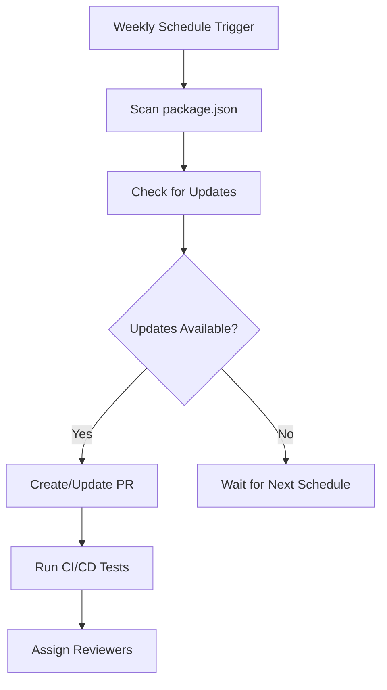

# Dependabot Configuration Guide

## What is Dependabot?

Dependabot is GitHub's automated dependency management service that helps keep your project dependencies up-to-date and secure. It automatically scans your repository for outdated dependencies and creates pull requests to update them.

## Why Use Dependabot?

### Security Benefits

- **Vulnerability Management**: Automatically identifies and fixes security vulnerabilities in dependencies
- **Zero-day Protection**: Quick updates when security patches are released
- **Supply Chain Security**: Reduces risk from compromised or malicious packages

### Maintenance Benefits

- **Automated Updates**: Reduces manual effort in dependency management
- **Consistent Updates**: Ensures dependencies are regularly updated
- **Technical Debt Reduction**: Prevents accumulation of outdated dependencies
- **Compatibility Assurance**: Gradual updates help identify breaking changes early

### Development Workflow Benefits

- **Reduced Maintenance Overhead**: No need to manually check for updates
- **Structured Review Process**: Updates come as PRs for proper review
- **Grouping Strategy**: Related updates are grouped to reduce PR noise

## When Does Dependabot Work?

### Schedule Configuration

Based on our current configuration in `.github/dependabot.yml`:

- **Frequency**: Weekly updates
- **Day**: Every Sunday
- **Time**: 02:00 UTC
- **Trigger**: Automatic scan and PR creation

### Update Triggers

- **Scheduled Scans**: Weekly automated checks
- **Security Alerts**: Immediate updates for security vulnerabilities
- **Manual Triggers**: Can be manually triggered from GitHub interface

## How Dependabot Works

### 1. Dependency Scanning Process



### 2. Configuration Breakdown

#### Package Ecosystem

```yaml
package-ecosystem: 'npm'
directory: '/'
```

- **npm**: Monitors Node.js dependencies in package.json
- **directory**: Scans from root directory

#### Schedule Settings

```yaml
schedule:
  interval: 'weekly'
  day: 'sunday'
  time: '02:00'
```

- **Interval**: Updates frequency (weekly)
- **Day**: Specific day for updates (Sunday)
- **Time**: UTC time for update checks (2:00 AM)

#### Pull Request Management

```yaml
open-pull-requests-limit: 5
reviewers:
  - 'ahafeesgit'
assignees:
  - 'ahafeesgit'
```

- **Limit**: Maximum 5 open PRs at once
- **Reviewers**: Automatically assigns reviewers
- **Assignees**: Automatically assigns PR to team members

#### Commit Message Configuration

```yaml
commit-message:
  prefix: 'chore'
  include: 'scope'
```

- **Prefix**: All commits start with "chore"
- **Scope**: Includes dependency name in commit message
- **Example**: `chore(deps): bump express from 4.18.0 to 4.18.2`

### 3. Grouping Strategy

#### Development Dependencies Group

```yaml
dev-dependencies:
  patterns:
    - '@types/*'
    - 'eslint*'
    - 'prettier*'
    - 'typescript'
    - '@typescript-eslint/*'
    - 'jest*'
    - '@nestjs/testing'
  update-types:
    - 'minor'
    - 'patch'
```

**Purpose**: Groups development-related packages together
**Benefits**:

- Reduces PR noise by combining related updates
- Safer to merge as these don't affect production
- Includes TypeScript definitions, linting tools, testing frameworks

#### Production Dependencies Group

```yaml
production-dependencies:
  patterns:
    - '*'
  exclude-patterns:
    - '@types/*'
    - 'eslint*'
    - 'prettier*'
    - 'typescript'
    - '@typescript-eslint/*'
    - 'jest*'
    - '@nestjs/testing'
  update-types:
    - 'patch'
```

**Purpose**: Groups production dependencies separately
**Benefits**:

- More careful approach with patch-only updates
- Excludes dev dependencies to avoid conflicts
- Critical path updates get focused attention

## Best Practices Implementation

### 1. Review Process

- **Automated Testing**: CI pipeline runs on every Dependabot PR
- **Manual Review**: Assigned reviewers check for breaking changes
- **Staged Deployment**: Test in development before production

### 2. Security Priority

- **Immediate Action**: Security updates are prioritized
- **Vulnerability Scanning**: Automated security checks
- **Audit Logging**: Track all dependency changes

### 3. Conflict Resolution

- **Automatic Rebasing**: Dependabot rebases PRs when conflicts occur
- **Manual Intervention**: Complex conflicts require manual resolution
- **Version Pinning**: Critical dependencies can be pinned to specific versions

## Monitoring and Maintenance

### 1. Regular Monitoring

- **Weekly Review**: Check Dependabot PRs every Sunday
- **Security Alerts**: Monitor GitHub security advisories
- **Failed Updates**: Investigate and resolve failed update attempts

### 2. Configuration Updates

- **Seasonal Reviews**: Quarterly review of Dependabot configuration
- **Ecosystem Changes**: Update patterns when adding new package types
- **Schedule Adjustments**: Modify timing based on team availability

### 3. Metrics Tracking

- **Update Success Rate**: Monitor successful vs failed updates
- **Security Response Time**: Track time to resolve security issues
- **Dependency Age**: Monitor overall dependency freshness

## Troubleshooting Common Issues

### 1. Too Many PRs

- **Solution**: Adjust `open-pull-requests-limit`
- **Alternative**: Modify grouping patterns to combine more updates

### 2. Breaking Changes

- **Solution**: Use `update-types: ["patch"]` for sensitive dependencies
- **Alternative**: Pin critical dependencies to specific versions

### 3. CI Failures

- **Solution**: Review and fix test suite compatibility
- **Alternative**: Temporarily exclude problematic packages

## Integration with Other Tools

### 1. GitHub Actions

- **CI/CD Pipeline**: Automatic testing of Dependabot PRs
- **Auto-merge**: Can be configured for patch updates
- **Notifications**: Integration with Slack/Teams for alerts

### 2. Security Tools

- **GitHub Security**: Native integration with security advisories
- **Snyk Integration**: Additional vulnerability scanning
- **Audit Tools**: Regular dependency auditing

## Conclusion

Dependabot is an essential tool for maintaining secure and up-to-date dependencies in the TaskManager-Server project. The current configuration balances automation with control, ensuring regular updates while maintaining code quality and security standards.

Regular monitoring and occasional configuration adjustments ensure optimal performance and alignment with project needs.
