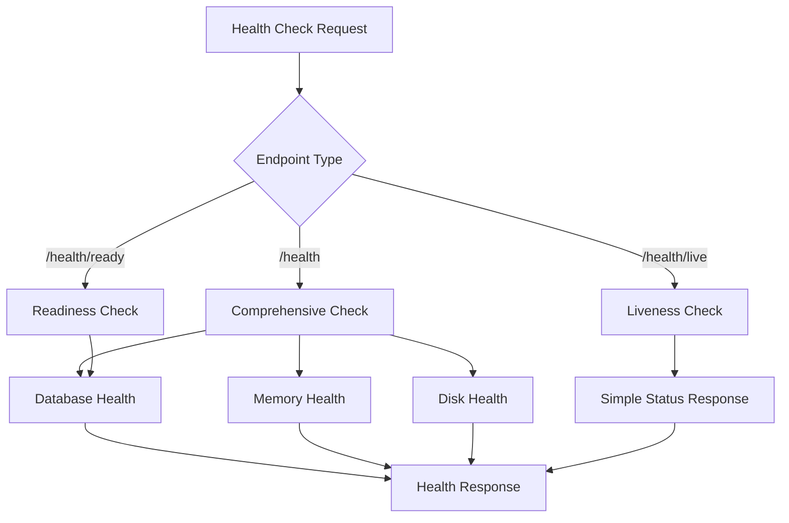

# Health Check System Documentation

## What is the Health Check System?

The Health Check System is a comprehensive monitoring solution built using NestJS Terminus that provides multiple endpoints to monitor the TaskManager-Server's health, readiness, and liveness. It implements industry-standard health check patterns used in containerized applications and microservices architectures.

## Why Use Health Checks?

### Application Monitoring Benefits
- **System Health Visibility**: Real-time insight into application and infrastructure health
- **Early Problem Detection**: Identify issues before they impact users
- **Automated Recovery**: Enable orchestrators (Kubernetes, Docker) to restart unhealthy containers
- **Load Balancer Integration**: Remove unhealthy instances from traffic rotation

### DevOps Integration Benefits
- **Container Orchestration**: Kubernetes health probes for pod management
- **Service Discovery**: Health-aware service registration and discovery
- **Monitoring Integration**: Structured data for monitoring systems (Prometheus, Grafana)
- **Alerting**: Trigger alerts based on health check failures

### Production Reliability Benefits
- **Zero-Downtime Deployments**: Ensure new versions are healthy before routing traffic
- **Resource Monitoring**: Track memory, disk, and database usage
- **Dependency Validation**: Verify external service connectivity
- **Performance Baseline**: Monitor system performance metrics

## When Do Health Checks Execute?

### Endpoint Access Patterns
The health check system provides three distinct endpoints, each serving different purposes:

#### 1. General Health Check (`/health`)
- **Usage**: Comprehensive system health assessment
- **Frequency**: Typically called every 30-60 seconds by monitoring systems
- **Purpose**: Overall system health including all dependencies

#### 2. Readiness Check (`/health/ready`)
- **Usage**: Kubernetes readiness probes, load balancer health checks
- **Frequency**: Every 10-30 seconds during startup and traffic routing decisions
- **Purpose**: Determine if application can handle incoming requests

#### 3. Liveness Check (`/health/live`)
- **Usage**: Kubernetes liveness probes, basic uptime monitoring
- **Frequency**: Every 30-60 seconds for basic availability monitoring
- **Purpose**: Verify application process is running and responsive

## How the Health Check System Works

### 1. System Architecture



### 2. Technical Implementation

#### Module Structure
```typescript
@Module({
  imports: [TerminusModule, PrismaModule],
  controllers: [HealthController],
})
export class HealthModule {}
```

**Dependencies**:
- **TerminusModule**: NestJS health check framework
- **PrismaModule**: Database connectivity for health checks
- **HealthController**: Endpoint implementation

#### Health Check Service Integration
```typescript
constructor(
  private health: HealthCheckService,
  private prismaHealth: PrismaHealthIndicator,
  private memory: MemoryHealthIndicator,
  private disk: DiskHealthIndicator,
  private prisma: PrismaService,
) {}
```

**Injected Services**:
- **HealthCheckService**: Terminus orchestration service
- **PrismaHealthIndicator**: Database connectivity checker
- **MemoryHealthIndicator**: Memory usage monitor
- **DiskHealthIndicator**: Disk space monitor
- **PrismaService**: Database connection instance

## Health Check Endpoints Deep Dive

### 1. Comprehensive Health Check (`GET /health`)

#### Purpose
Provides complete system health assessment including all critical dependencies and resources.

#### Implementation
```typescript
@Get()
@HealthCheck()
check() {
  return this.health.check([
    // Database connectivity
    () => this.prismaHealth.pingCheck('database', this.prisma as PrismaClient),
    
    // Memory thresholds
    () => this.memory.checkHeap('memory_heap', 150 * 1024 * 1024),
    () => this.memory.checkRSS('memory_rss', 200 * 1024 * 1024),
    
    // Disk usage
    () => this.disk.checkStorage('storage', {
      path: '/',
      thresholdPercent: 0.9,
    }),
  ]);
}
```

#### Health Checks Performed

##### Database Health Check
```typescript
this.prismaHealth.pingCheck('database', this.prisma as PrismaClient)
```
- **Purpose**: Verify database connectivity and responsiveness
- **Method**: Executes a simple ping query to the database
- **Failure Conditions**: Connection timeout, authentication failure, database unavailable

##### Memory Health Checks
```typescript
// Heap Memory Check
this.memory.checkHeap('memory_heap', 150 * 1024 * 1024)  // 150MB limit

// RSS Memory Check  
this.memory.checkRSS('memory_rss', 200 * 1024 * 1024)    // 200MB limit
```

**Memory Types Monitored**:
- **Heap Memory**: JavaScript heap size (150MB threshold)
- **RSS Memory**: Resident Set Size - total memory usage (200MB threshold)

**Threshold Rationale**:
- Conservative limits prevent out-of-memory conditions
- Allows headroom for traffic spikes
- Triggers early warnings for memory leaks

##### Disk Storage Check
```typescript
this.disk.checkStorage('storage', {
  path: '/',
  thresholdPercent: 0.9,
})
```
- **Monitored Path**: Root filesystem (`/`)
- **Threshold**: 90% disk usage
- **Purpose**: Prevent disk space exhaustion affecting logs, temporary files

#### Response Format
```json
{
  "status": "ok",
  "info": {
    "database": {
      "status": "up"
    },
    "memory_heap": {
      "status": "up"
    },
    "memory_rss": {
      "status": "up"
    },
    "storage": {
      "status": "up"
    }
  },
  "error": {},
  "details": {
    "database": {
      "status": "up"
    },
    "memory_heap": {
      "status": "up"
    },
    "memory_rss": {
      "status": "up"
    },
    "storage": {
      "status": "up"
    }
  }
}
```

### 2. Readiness Check (`GET /health/ready`)

#### Purpose
Determines if the application is ready to handle incoming HTTP requests. Used by load balancers and orchestrators to route traffic.

#### Implementation
```typescript
@Get('ready')
@HealthCheck()
ready() {
  return this.health.check([
    () => this.prismaHealth.pingCheck('database', this.prisma as PrismaClient),
  ]);
}
```

#### Design Rationale
- **Minimal Checks**: Only verifies essential dependencies (database)
- **Fast Execution**: Quick response for frequent polling
- **Traffic Routing**: Determines if instance should receive requests

#### Use Cases
- **Kubernetes Readiness Probes**: Pod traffic routing decisions
- **Load Balancer Health Checks**: Instance availability for traffic
- **Blue-Green Deployments**: Verify new version readiness
- **Auto Scaling**: Determine when new instances are ready

#### Response Format
```json
{
  "status": "ok",
  "info": {
    "database": {
      "status": "up"
    }
  },
  "error": {},
  "details": {
    "database": {
      "status": "up"
    }
  }
}
```

### 3. Liveness Check (`GET /health/live`)

#### Purpose
Basic availability check to verify the application process is running and responsive. Simplest health check for basic monitoring.

#### Implementation
```typescript
@Get('live')
liveness() {
  return {
    status: 'ok',
    timestamp: new Date().toISOString(),
    uptime: process.uptime(),
  };
}
```

#### Features
- **No Dependencies**: Doesn't check external resources
- **Process Information**: Includes uptime and timestamp
- **Minimal Overhead**: Fastest possible response
- **Always Available**: Returns 200 unless application is completely down

#### Use Cases
- **Kubernetes Liveness Probes**: Container restart decisions
- **Basic Monitoring**: Simple "is it running" checks
- **Uptime Tracking**: Application availability metrics
- **Process Monitoring**: Verify application hasn't crashed

#### Response Format
```json
{
  "status": "ok",
  "timestamp": "2025-10-07T12:00:00.000Z",
  "uptime": 3600.123
}
```

## API Documentation Integration

### Swagger/OpenAPI Annotations
```typescript
@ApiTags('health')
@Controller('health')

@ApiOperation({ summary: 'Get application health status' })
@ApiResponse({ status: 200, description: 'Health check successful' })
@ApiResponse({ status: 503, description: 'Health check failed' })
```

#### Benefits
- **API Documentation**: Automatic API documentation generation
- **Response Codes**: Clear documentation of success/failure scenarios
- **Integration Testing**: Facilitates automated testing
- **Developer Experience**: Self-documenting endpoints

## Monitoring and Alerting Integration

### 1. Prometheus Integration

#### Metrics Collection
Health check endpoints can be integrated with Prometheus for metrics collection:

```yaml
# Prometheus scrape configuration
scrape_configs:
  - job_name: 'taskmanager-health'
    scrape_interval: 30s
    metrics_path: '/health'
    static_configs:
      - targets: ['taskmanager:3000']
```

#### Custom Metrics
```typescript
// Example: Custom health metrics
@Injectable()
export class HealthMetricsService {
  private healthCheckCounter = new Counter({
    name: 'health_check_total',
    help: 'Total number of health checks',
    labelNames: ['endpoint', 'status']
  });
}
```

### 2. Alerting Rules

#### Critical Alerts
```yaml
# Alertmanager rules
groups:
  - name: taskmanager-health
    rules:
      - alert: ApplicationDown
        expr: up{job="taskmanager-health"} == 0
        for: 1m
        labels:
          severity: critical
        annotations:
          summary: "TaskManager application is down"
      
      - alert: DatabaseUnhealthy
        expr: health_check_status{check="database"} != 1
        for: 2m
        labels:
          severity: critical
        annotations:
          summary: "Database health check failing"
```

### 3. Kubernetes Integration

#### Pod Configuration
```yaml
apiVersion: v1
kind: Pod
spec:
  containers:
  - name: taskmanager
    image: taskmanager:latest
    ports:
    - containerPort: 3000
    
    # Liveness probe
    livenessProbe:
      httpGet:
        path: /health/live
        port: 3000
      initialDelaySeconds: 30
      periodSeconds: 60
      timeoutSeconds: 5
      failureThreshold: 3
    
    # Readiness probe
    readinessProbe:
      httpGet:
        path: /health/ready
        port: 3000
      initialDelaySeconds: 10
      periodSeconds: 30
      timeoutSeconds: 5
      failureThreshold: 2
```

## Testing Strategy

### 1. Integration Tests

The health check system includes comprehensive integration tests:

```typescript
describe('HealthController (Integration)', () => {
  // Test comprehensive health check
  it('should return health status', () => {
    return request(app.getHttpServer())
      .get('/health')
      .expect(200)
      .expect((res) => {
        expect(res.body).toHaveProperty('status');
        expect(res.body).toHaveProperty('info');
        expect(res.body).toHaveProperty('details');
      });
  });

  // Test readiness check
  it('should return readiness status', () => {
    return request(app.getHttpServer())
      .get('/health/ready')
      .expect(200);
  });

  // Test liveness check
  it('should return liveness status', () => {
    return request(app.getHttpServer())
      .get('/health/live')
      .expect(200)
      .expect((res) => {
        expect(res.body).toHaveProperty('status', 'ok');
        expect(res.body).toHaveProperty('timestamp');
        expect(res.body).toHaveProperty('uptime');
      });
  });
});
```

### 2. Health Check Validation

#### Manual Testing
```bash
# Test all health endpoints
curl -X GET http://localhost:3000/health
curl -X GET http://localhost:3000/health/ready  
curl -X GET http://localhost:3000/health/live

# Test with detailed output
curl -X GET http://localhost:3000/health | jq .

# Monitor health over time
watch -n 5 'curl -s http://localhost:3000/health/live | jq .'
```

#### Load Testing
```bash
# Test health endpoint under load
ab -n 1000 -c 10 http://localhost:3000/health/live

# Monitor response times
siege -c 10 -t 60s http://localhost:3000/health/ready
```

## Best Practices Implementation

### 1. Threshold Configuration

#### Memory Thresholds
- **Heap Memory**: 150MB (conservative for Node.js applications)
- **RSS Memory**: 200MB (includes non-heap memory)
- **Rationale**: Prevents OOM conditions while allowing normal operations

#### Disk Thresholds
- **Storage**: 90% usage threshold
- **Rationale**: Maintains space for logs, temporary files, and emergency operations

#### Database Connectivity
- **Timeout**: Quick ping check for responsiveness
- **Connection Pooling**: Leverages existing Prisma connections

### 2. Performance Optimization

#### Caching Strategy
```typescript
// Example: Cache health check results for brief periods
@Injectable()
export class CachedHealthService {
  private cache = new Map();
  private readonly CACHE_TTL = 10000; // 10 seconds

  async getCachedHealth(key: string, checkFn: () => Promise<any>) {
    const cached = this.cache.get(key);
    if (cached && Date.now() - cached.timestamp < this.CACHE_TTL) {
      return cached.result;
    }
    
    const result = await checkFn();
    this.cache.set(key, { result, timestamp: Date.now() });
    return result;
  }
}
```

#### Async Health Checks
```typescript
// Parallel execution for faster response
async comprehensiveHealthCheck() {
  const checks = await Promise.allSettled([
    this.databaseCheck(),
    this.memoryCheck(),
    this.diskCheck(),
  ]);
  
  return this.aggregateResults(checks);
}
```

### 3. Error Handling

#### Graceful Degradation
```typescript
// Handle partial failures gracefully
@Get('health')
async check() {
  try {
    return await this.health.check([...healthChecks]);
  } catch (error) {
    // Log error but still provide partial health information
    this.logger.error('Health check failed', error);
    return {
      status: 'error',
      timestamp: new Date().toISOString(),
      error: error.message,
    };
  }
}
```

## Troubleshooting Common Issues

### 1. Database Health Failures

#### Connection Issues
**Symptoms**: Database health check failing, 503 responses
**Diagnosis**:
```bash
# Check database connectivity
curl -X GET http://localhost:3000/health/ready

# Check database status
docker exec -it postgres-container pg_isready
```

**Solutions**:
- Verify database container is running
- Check connection string configuration
- Validate database credentials
- Monitor connection pool exhaustion

### 2. Memory Health Failures

#### Memory Threshold Exceeded
**Symptoms**: Memory health checks failing, high RSS/heap usage
**Diagnosis**:
```bash
# Monitor memory usage
curl -X GET http://localhost:3000/health | jq '.details.memory_heap'

# Check Node.js memory usage
node --inspect index.js
```

**Solutions**:
- Investigate memory leaks using heap snapshots
- Adjust memory thresholds if appropriate
- Optimize code for memory efficiency
- Consider horizontal scaling

### 3. Disk Health Failures

#### Disk Space Exhaustion
**Symptoms**: Storage health check failing, disk usage above 90%
**Diagnosis**:
```bash
# Check disk usage
df -h

# Find large files
du -sh /* | sort -rh | head -10
```

**Solutions**:
- Clean up log files and temporary files
- Implement log rotation
- Monitor disk usage trends
- Consider storage scaling

### 4. Performance Issues

#### Slow Health Check Response
**Symptoms**: Health endpoints timing out or responding slowly
**Solutions**:
- Optimize database queries in health checks
- Implement health check result caching
- Reduce check frequency for expensive operations
- Consider async health check patterns

## Security Considerations

### 1. Information Disclosure

#### Sensitive Information
- **Database Details**: Avoid exposing connection strings or credentials
- **System Information**: Limit exposure of internal system details
- **Error Messages**: Sanitize error messages in production

#### Access Control
```typescript
// Example: Protect health endpoints with authentication
@UseGuards(AuthGuard)
@Get('health/detailed')
detailedHealth() {
  // Detailed health information for authorized users only
}
```

### 2. Rate Limiting

```typescript
// Prevent health endpoint abuse
@UseGuards(ThrottlerGuard)
@Throttle(100, 60) // 100 requests per minute
@Get('health')
check() {
  // Health check implementation
}
```

## Conclusion

The Health Check System provides comprehensive monitoring capabilities that are essential for production deployments of the TaskManager-Server. By implementing multiple health check patterns (comprehensive, readiness, liveness), the system supports various operational scenarios from basic uptime monitoring to sophisticated orchestration integration.

The system's design balances thoroughness with performance, providing detailed health information while maintaining fast response times for frequent polling. Integration with industry-standard tools and patterns ensures compatibility with modern DevOps and monitoring ecosystems.

Regular monitoring of health check performance and threshold tuning ensures the system continues to provide accurate health assessments as the application evolves and scales.
