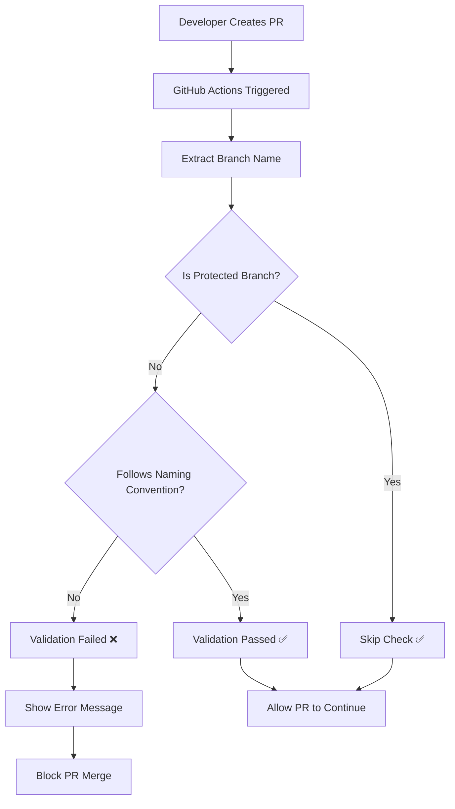

# Branch Naming Convention Workflow

## 📋 Overview

The Branch Naming Convention workflow is a GitHub Actions automation that enforces consistent branch naming standards across the TaskManager-Server project. It automatically validates branch names when pull requests are created, ensuring all contributors follow the established naming conventions.

## 🎯 Purpose

- **Consistency**: Maintains uniform branch naming across the project
- **Organization**: Makes it easy to identify the purpose of each branch
- **Automation**: Prevents non-compliant branches from being merged
- **Team Collaboration**: Ensures all team members follow the same standards

## ⚡ When Does It Execute?

The workflow triggers automatically on:

```yaml
on:
  pull_request:
    branches: ['dev', 'staging', 'main']
```

**Trigger Conditions:**

- ✅ When a Pull Request is **opened**
- ✅ When a Pull Request is **synchronized** (new commits pushed)
- ✅ When targeting **dev**, **staging**, or **main** branches
- ❌ Does NOT run on direct pushes to branches
- ❌ Does NOT run on internal branch operations

## 🔄 Workflow Process



## 📝 Branch Naming Rules

### ✅ Allowed Patterns

| Prefix     | Description             | Example                       |
| ---------- | ----------------------- | ----------------------------- |
| `feature/` | New functionality       | `feature/user-authentication` |
| `fix/`     | Bug fixes               | `fix/login-validation`        |
| `hotfix/`  | Critical fixes          | `hotfix/security-patch`       |
| `bugfix/`  | Bug fixes (alternative) | `bugfix/api-validation`       |
| `chore/`   | Maintenance tasks       | `chore/update-dependencies`   |
| `docs/`    | Documentation updates   | `docs/api-documentation`      |

### 🔒 Protected Branches (Exempt)

These branches skip the naming convention check:

- `main` - Production branch
- `staging` - Pre-production branch
- `dev` - Development branch

## 🛠 How It Works

### Step-by-Step Process

1. **Trigger Detection**

   ```bash
   # When PR is created targeting main/staging/dev
   on: pull_request: branches: ["dev", "staging", "main"]
   ```

2. **Branch Name Extraction**

   ```bash
   branch_name="${{ github.head_ref }}"
   echo "🔍 Checking branch name: '$branch_name'"
   ```

3. **Protected Branch Check**

   ```bash
   if [[ $branch_name =~ ^(main|staging|dev)$ ]]; then
     echo "✅ Protected branch '$branch_name' - skipping check"
     exit 0
   fi
   ```

4. **Naming Convention Validation**

   ```bash
   if [[ ! $branch_name =~ ^(feature|fix|hotfix|bugfix|chore|docs)/.+ ]]; then
     # Show detailed error message
     exit 1  # Fail the check
   fi
   ```

5. **Success Response**
   ```bash
   echo "✅ Branch name '$branch_name' follows naming convention!"
   ```

## 📊 Visual Workflow Representation

### Workflow Architecture

```
┌─────────────────────────────────────────────────────────────────┐
│                    GitHub Repository                             │
├─────────────────────────────────────────────────────────────────┤
│  Branches:                                                      │
│  ├── main (protected)                                          │
│  ├── staging (protected)                                       │
│  ├── dev (protected)                                          │
│  └── feature/user-auth (validation required)                  │
└─────────────────────────────────────────────────────────────────┘
                              │
                              ▼
┌─────────────────────────────────────────────────────────────────┐
│                   Pull Request Created                          │
│  From: feature/user-auth → To: dev                            │
└─────────────────────────────────────────────────────────────────┘
                              │
                              ▼
┌─────────────────────────────────────────────────────────────────┐
│              GitHub Actions Workflow Triggered                  │
│  File: .github/workflows/branch-naming.yml                     │
└─────────────────────────────────────────────────────────────────┘
                              │
                              ▼
┌─────────────────────────────────────────────────────────────────┐
│                  Branch Name Validation                         │
│  ✅ feature/user-auth → PASS                                   │
│  ❌ user-auth → FAIL                                          │
└─────────────────────────────────────────────────────────────────┘
```

### Success Flow

```
Developer Action          GitHub Response           Result
─────────────────         ─────────────────         ──────
Create branch:
feature/user-login   →    Validation Check    →     ✅ PASS

Create PR to dev     →    Workflow Runs       →     ✅ PASS

Continue with PR     →    Merge Available     →     🎉 SUCCESS
```

### Failure Flow

```
Developer Action          GitHub Response           Result
─────────────────         ─────────────────         ──────
Create branch:
user-login-fix       →    Validation Check    →     ❌ FAIL

Create PR to dev     →    Workflow Runs       →     ❌ FAIL

Error Message        →    PR Blocked          →     🚫 BLOCKED
```

## 🚀 Usage Examples

### ✅ Valid Branch Names

```bash
# Feature development
git checkout -b feature/user-authentication
git checkout -b feature/task-management
git checkout -b feature/email-notifications

# Bug fixes
git checkout -b fix/login-validation
git checkout -b fix/api-error-handling
git checkout -b bugfix/memory-leak

# Hotfixes
git checkout -b hotfix/security-vulnerability
git checkout -b hotfix/production-crash

# Maintenance
git checkout -b chore/update-dependencies
git checkout -b chore/cleanup-code

# Documentation
git checkout -b docs/api-documentation
git checkout -b docs/readme-updates
```

### ❌ Invalid Branch Names

```bash
# Missing prefix
git checkout -b user-authentication        # ❌ Missing feature/
git checkout -b login-fix                  # ❌ Missing fix/
git checkout -b update-docs                # ❌ Missing docs/

# Incorrect format
git checkout -b feature-user-auth          # ❌ Should be feature/
git checkout -b new/feature/login          # ❌ Invalid prefix
git checkout -b my-branch                  # ❌ No recognized prefix
```

## 🔧 Error Messages and Solutions

### Common Error Scenario

When validation fails, developers see this detailed message:

```
❌ Branch name 'user-login-fix' does not follow naming convention!

📋 Branch Naming Rules:
✅ Protected branches (allowed): main, staging, dev
✅ Feature branches must use: feature/your-feature-name
✅ Bug fixes must use: fix/your-fix-name
✅ Allowed prefixes: feature/, fix/, hotfix/, bugfix/, chore/, docs/

📝 Examples:
  ✅ feature/user-authentication
  ✅ fix/login-validation
  ✅ hotfix/security-patch

🔧 To fix: Rename your branch using:
  git branch -m user-login-fix fix/user-login-fix
```

### How to Fix Non-Compliant Branches

```bash
# If you already created a branch with wrong name
git branch -m old-branch-name feature/new-branch-name

# Push the renamed branch
git push origin -u feature/new-branch-name

# Delete the old branch from remote
git push origin --delete old-branch-name
```

## ⚙️ Workflow Configuration

### File Location

```
.github/workflows/branch-naming.yml
```

### Key Configuration Options

```yaml
# Trigger conditions
on:
  pull_request:
    branches: ['dev', 'staging', 'main']

# Job configuration
jobs:
  check-branch-name:
    name: Check Branch Name
    runs-on: ubuntu-latest
```

### Customizing the Workflow

To modify the naming conventions, update the regex pattern:

```bash
# Current pattern
^(feature|fix|hotfix|bugfix|chore|docs)/.+

# Add new prefixes (example)
^(feature|fix|hotfix|bugfix|chore|docs|test|refactor)/.+
```

## 📈 Benefits

### For Developers

- **Clear Guidelines**: Know exactly how to name branches
- **Immediate Feedback**: Get instant validation on PR creation
- **Consistent Standards**: Follow team conventions automatically

### For Project Management

- **Easy Identification**: Quickly understand branch purpose
- **Better Organization**: Categorize work by type
- **Quality Control**: Enforce standards across the team

### for Repository Maintenance

- **Automated Enforcement**: No manual review needed
- **Consistent History**: Clean git history with meaningful branch names
- **Reduced Conflicts**: Clear naming prevents confusion

## 🎯 Best Practices

### Branch Naming Tips

1. **Be Descriptive**: Use clear, meaningful names

   ```bash
   ✅ feature/jwt-authentication
   ❌ feature/auth
   ```

2. **Use Lowercase**: Stick to lowercase with hyphens

   ```bash
   ✅ feature/user-profile-management
   ❌ feature/UserProfileManagement
   ```

3. **Keep It Concise**: Aim for 2-4 words after the prefix

   ```bash
   ✅ fix/api-validation-error
   ❌ fix/the-api-validation-error-that-occurs-in-production
   ```

4. **Use Hyphens**: Separate words with hyphens, not underscores
   ```bash
   ✅ feature/user-settings
   ❌ feature/user_settings
   ```

### Workflow Integration

This workflow works seamlessly with:

- **Code Review Process**: Validates before review
- **Continuous Integration**: Runs alongside other checks
- **Branch Protection Rules**: Complements GitHub's native protections
- **Team Collaboration**: Ensures everyone follows standards

## 🔍 Troubleshooting

### Common Issues

1. **Workflow Not Running**
   - Verify the YAML file is in `.github/workflows/`
   - Check indentation and syntax
   - Ensure PR targets dev/staging/main

2. **False Positives**
   - Review the regex pattern
   - Check for typos in branch names
   - Verify case sensitivity

3. **Bypass for Special Cases**
   - Consider adding the branch to protected list
   - Or create a temporary exception in the workflow

### Debug Commands

```bash
# Check current branch name
git branch --show-current

# List all branches
git branch -a

# Rename branch
git branch -m old-name new-name

# Check workflow runs
# Go to GitHub → Actions → Branch Naming Convention
```

This workflow ensures consistent, organized, and professional branch management across your TaskManager-Server project! 🚀
