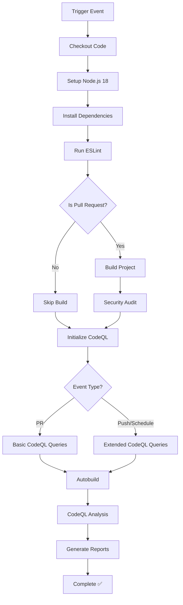

# CI Security Pipeline Workflow

## 📋 Overview

The CI Security Pipeline is a comprehensive GitHub Actions workflow that ensures code quality, security, and build integrity for the TaskManager-Server project. It combines linting, building, security auditing, and advanced code analysis into a single automated pipeline.

## 🎯 Purpose

- **Code Quality**: Enforces coding standards through ESLint
- **Build Verification**: Ensures code compiles successfully
- **Security Scanning**: Identifies vulnerabilities and security issues
- **Automated Analysis**: Uses GitHub's CodeQL for deep code analysis
- **Continuous Integration**: Runs on every pull request and push to dev

## ⚡ When Does It Execute?

The workflow triggers on multiple events with smart optimization:

```yaml
on:
  pull_request:
    branches: ['dev']
    paths:
      - '**/*.ts'
      - '**/*.js'
      - '**/*.tsx'
      - '**/*.jsx'
      - 'package*.json'
      - 'prisma/**'
  push:
    branches: ['dev']
  schedule:
    - cron: '0 2 1 * *' # Monthly at 2 AM on 1st day
```

### Trigger Scenarios

| Event            | When                            | Why                                   |
| ---------------- | ------------------------------- | ------------------------------------- |
| **Pull Request** | Code changes to dev branch      | Quality gate before merge             |
| **Push**         | Direct push to dev branch       | Continuous monitoring                 |
| **Schedule**     | Monthly (1st day, 2 AM)         | Regular security scanning             |
| **Path Filter**  | Only when relevant files change | Optimization - avoid unnecessary runs |

## 🔄 Workflow Process



## 🛠 Detailed Job Breakdown

### Job Configuration

```yaml
ci-security:
  name: Lint, Build & Security Scan
  runs-on: ubuntu-latest
  timeout-minutes: 15
  permissions:
    actions: read
    contents: read
    security-events: write
```

**Key Settings:**

- **Runtime**: Ubuntu Latest (fastest, most compatible)
- **Timeout**: 15 minutes (prevents hung jobs)
- **Permissions**: Minimal required for security scanning

### Step-by-Step Analysis

#### 1. **Environment Setup**

```yaml
- name: Checkout repository
  uses: actions/checkout@v4

- name: Setup Node.js
  uses: actions/setup-node@v4
  with:
    node-version: '18'
    cache: 'npm'
```

**What it does:**

- Downloads the repository code
- Installs Node.js version 18
- Enables npm caching for faster runs

#### 2. **Dependency Installation**

```yaml
- name: Install dependencies
  run: npm ci
```

**Why `npm ci` over `npm install`:**

- ✅ Faster installation
- ✅ Uses exact versions from package-lock.json
- ✅ Better for CI/CD environments
- ✅ Ensures reproducible builds

#### 3. **Code Quality Check**

```yaml
- name: Run ESLint
  run: npm run lint
```

**Validates:**

- TypeScript/JavaScript syntax
- Code style consistency
- Potential bugs and issues
- Security anti-patterns

#### 4. **Build Verification (PR Only)**

```yaml
- name: Build project
  if: github.event_name == 'pull_request'
  run: npm run build
```

**Smart Optimization:**

- Only runs on pull requests
- Avoids redundancy with CodeQL autobuild
- Ensures code compiles before merge

#### 5. **Security Audit (PR Only)**

```yaml
- name: Quick security audit
  if: github.event_name == 'pull_request'
  run: npm audit --audit-level=high
  continue-on-error: true
```

**Features:**

- Checks for high-severity vulnerabilities
- Non-blocking (continues on error)
- Complements Dependabot's weekly scans

#### 6. **CodeQL Security Analysis**

```yaml
- name: Initialize CodeQL
  uses: github/codeql-action/init@v3
  with:
    languages: javascript
    queries: ${{ github.event_name == 'pull_request' && 'security-only' || 'security-extended,security-and-quality' }}
```

**Dynamic Query Selection:**

- **Pull Requests**: `security-only` (faster feedback)
- **Push/Schedule**: `security-extended,security-and-quality` (comprehensive)

## 📊 Visual Workflow Architecture

### Pipeline Flow

```
┌─────────────────────────────────────────────────────────────────┐
│                     Trigger Events                              │
├─────────────────────────────────────────────────────────────────┤
│  Pull Request → dev    │  Push → dev     │  Monthly Schedule   │
│  (Code Changes)        │  (Direct Push)  │  (Security Scan)    │
└─────────────────────────────────────────────────────────────────┘
                              │
                              ▼
┌─────────────────────────────────────────────────────────────────┐
│                  Environment Setup                              │
├─────────────────────────────────────────────────────────────────┤
│  Ubuntu Runner → Node.js 18 → npm ci                          │
└─────────────────────────────────────────────────────────────────┘
                              │
                              ▼
┌─────────────────────────────────────────────────────────────────┐
│                   Quality Checks                                │
├─────────────────────────────────────────────────────────────────┤
│  ESLint → Build (PR) → Security Audit (PR)                    │
└─────────────────────────────────────────────────────────────────┘
                              │
                              ▼
┌─────────────────────────────────────────────────────────────────┐
│                  Security Analysis                              │
├─────────────────────────────────────────────────────────────────┤
│  CodeQL Init → Autobuild → Analysis → Reports                 │
└─────────────────────────────────────────────────────────────────┘
```

### Event-Based Execution Matrix

| Step                | Pull Request | Push to Dev | Scheduled |
| ------------------- | ------------ | ----------- | --------- |
| **ESLint**          | ✅ Always    | ✅ Always   | ✅ Always |
| **Build**           | ✅ Yes       | ❌ No       | ❌ No     |
| **npm audit**       | ✅ Yes       | ❌ No       | ❌ No     |
| **CodeQL Basic**    | ✅ Yes       | ❌ No       | ❌ No     |
| **CodeQL Extended** | ❌ No        | ✅ Yes      | ✅ Yes    |

## 🚀 Execution Examples

### Pull Request Scenario

```
Developer creates PR: feature/user-auth → dev
├── Trigger: pull_request event
├── Path check: *.ts files changed ✅
├── Run ESLint: Check code style ✅
├── Build project: Verify compilation ✅
├── Security audit: Check high vulnerabilities ✅
├── CodeQL: Run security-only queries ✅
└── Result: All checks passed → Ready for review
```

### Push to Dev Scenario

```
Code merged to dev branch
├── Trigger: push event
├── Run ESLint: Verify code quality ✅
├── Skip build: (Already verified in PR)
├── Skip audit: (Dependabot handles this)
├── CodeQL: Run extended security analysis ✅
└── Result: Comprehensive security scan complete
```

### Scheduled Security Scan

```
Monthly security review (1st day, 2 AM)
├── Trigger: schedule event
├── Run ESLint: Code quality baseline ✅
├── CodeQL: Full security + quality analysis ✅
├── Generate reports: Security dashboard updated ✅
└── Result: Monthly security posture assessed
```

## 🔧 Configuration Details

### Path Filtering

The workflow only runs when these file types change:

```yaml
paths:
  - '**/*.ts' # TypeScript files
  - '**/*.js' # JavaScript files
  - '**/*.tsx' # React TypeScript
  - '**/*.jsx' # React JavaScript
  - 'package*.json' # Dependencies
  - 'prisma/**' # Database schema
```

**Benefits:**

- ⚡ Faster execution
- 💰 Reduced GitHub Actions minutes
- 🎯 Runs only when relevant

### CodeQL Query Selection

| Event Type    | Queries Used                             | Purpose                       |
| ------------- | ---------------------------------------- | ----------------------------- |
| Pull Request  | `security-only`                          | Fast feedback, security focus |
| Push/Schedule | `security-extended,security-and-quality` | Comprehensive analysis        |

### Timeout Protection

```yaml
timeout-minutes: 15
```

- Prevents workflows from running indefinitely
- Ensures quick feedback to developers
- Protects against stuck processes

## 📈 Benefits & Features

### For Developers

- **Fast Feedback**: Quick PR validation
- **Quality Assurance**: Automated code review
- **Security Awareness**: Early vulnerability detection
- **Build Confidence**: Verified compilation

### For Project Security

- **Automated Scanning**: Regular security assessments
- **Vulnerability Detection**: GitHub Security tab integration
- **Code Analysis**: Deep semantic understanding
- **Compliance**: Industry-standard security practices

### for CI/CD Pipeline

- **Optimized Performance**: Smart execution rules
- **Resource Efficiency**: Path filtering and conditional steps
- **Comprehensive Coverage**: Multiple analysis types
- **Integration**: Works with GitHub's security features

## 🛡️ Security Features

### CodeQL Analysis

```yaml
languages: javascript
queries: security-extended,security-and-quality
```

**Detects:**

- SQL injection vulnerabilities
- Cross-site scripting (XSS)
- Command injection
- Path traversal
- Authentication bypasses
- Cryptographic issues

### npm Security Audit

```bash
npm audit --audit-level=high
```

**Checks for:**

- Known vulnerabilities in dependencies
- Outdated packages with security issues
- Malicious packages
- License compliance issues

### Security Events Integration

```yaml
permissions:
  security-events: write
```

**Enables:**

- Security tab in GitHub repository
- Vulnerability alerts and notifications
- Security advisory integration
- Automated security reporting

## 🔍 Monitoring & Reporting

### GitHub Security Tab

Results appear in:

```
Repository → Security → Code scanning alerts
```

### Workflow Status

Monitor execution at:

```
Repository → Actions → CI Security Pipeline
```

### Failed Check Notifications

When checks fail, developers receive:

- ❌ PR status check failure
- 📧 Email notifications (if configured)
- 💬 PR comments with details

## ⚙️ Customization Options

### Modifying ESLint Rules

Update rules in `eslint.config.mjs`:

```javascript
export default [
  // Add custom rules here
];
```

### Changing CodeQL Queries

Modify the query selection:

```yaml
queries: custom-query-suite
```

### Adjusting Trigger Paths

Add more file types:

```yaml
paths:
  - '**/*.ts'
  - '**/*.json' # Add JSON files
  - 'Dockerfile' # Add Docker files
```

### Custom npm Scripts

The workflow uses these scripts:

```json
{
  "scripts": {
    "lint": "eslint \"{src,apps,libs,test}/**/*.ts\" --fix",
    "build": "nest build"
  }
}
```

## 🚨 Troubleshooting

### Common Issues

#### 1. **ESLint Failures**

```
Error: ESLint found problems
```

**Solution:**

```bash
# Fix automatically
npm run lint

# Or fix manually based on error messages
```

#### 2. **Build Failures**

```
Error: Build failed with TypeScript errors
```

**Solution:**

```bash
# Run build locally
npm run build

# Fix TypeScript errors
# Check imports, types, and syntax
```

#### 3. **Security Audit Failures**

```
Error: Found high severity vulnerabilities
```

**Solution:**

```bash
# Run audit locally
npm audit

# Fix vulnerabilities
npm audit fix

# Or update specific packages
npm update package-name
```

#### 4. **CodeQL Timeout**

```
Error: CodeQL analysis timed out
```

**Solution:**

- Increase timeout in workflow
- Reduce query scope for PR events
- Contact GitHub support for large repositories

### Debug Commands

```bash
# Test locally before pushing
npm run lint
npm run build
npm audit --audit-level=high

# Check workflow syntax
act --list  # If using act for local testing

# View detailed logs in GitHub Actions
```

## 📋 Best Practices

### For Development

1. **Test Locally**: Run lint and build before pushing
2. **Fix Issues Early**: Address ESLint warnings promptly
3. **Monitor Security**: Check GitHub Security tab regularly
4. **Update Dependencies**: Keep packages current

### For Workflow Maintenance

1. **Regular Updates**: Keep actions updated (dependabot helps)
2. **Monitor Performance**: Watch execution times
3. **Review Queries**: Adjust CodeQL queries as needed
4. **Documentation**: Keep this doc updated with changes

### For Security

1. **Review Alerts**: Act on security findings promptly
2. **Understand Reports**: Learn from CodeQL results
3. **Dependency Management**: Use Dependabot effectively
4. **Regular Scans**: Leverage monthly scheduled runs

## 🔗 Integration with Other Workflows

This pipeline works together with:

### Branch Naming Workflow

- Runs after branch name validation passes
- Ensures quality code in properly named branches

### Dependabot

- Monthly pipeline complements weekly dependency updates
- Provides additional security validation

### Manual Testing

- Quality checks before manual testing
- Builds confidence in feature completeness

This comprehensive CI Security Pipeline ensures your TaskManager-Server maintains high code quality and security standards throughout the development lifecycle! 🚀
