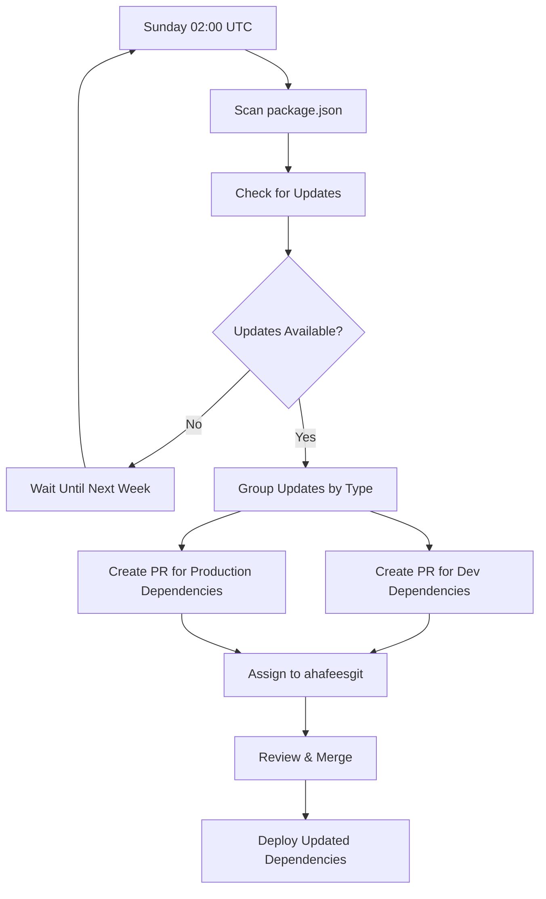

# Dependabot Configuration Guide

## 📋 Overview

Dependabot is GitHub's automated dependency management service that keeps your TaskManager-Server project secure and up-to-date by automatically creating pull requests for dependency updates. This configuration ensures your npm packages stay current while maintaining stability and reducing maintenance overhead.

## 🎯 Purpose

- **Security**: Automatically update packages with known vulnerabilities
- **Maintenance**: Keep dependencies current without manual intervention
- **Stability**: Group related updates to minimize disruption
- **Efficiency**: Reduce developer time spent on dependency management
- **Compliance**: Maintain security compliance with automated updates

## ⚡ When Does It Execute?

The Dependabot service runs according to this schedule:

```yaml
schedule:
  interval: 'weekly'
  day: 'sunday'
  time: '02:00'
```

### Schedule Details

| Aspect        | Configuration | Why                                    |
| ------------- | ------------- | -------------------------------------- |
| **Frequency** | Weekly        | Balances freshness with stability      |
| **Day**       | Sunday        | Off-peak time, ready for Monday review |
| **Time**      | 02:00 (UTC)   | Minimal user activity period           |
| **Timezone**  | UTC           | Consistent across global teams         |

## 🔄 How Dependabot Works



## 🛠 Configuration Breakdown

### Basic Settings

```yaml
version: 2
updates:
  - package-ecosystem: 'npm'
    directory: '/'
    schedule:
      interval: 'weekly'
      day: 'sunday'
      time: '02:00'
```

**Key Parameters:**

- **version: 2** - Latest Dependabot configuration format
- **package-ecosystem: 'npm'** - Targets npm/package.json dependencies
- **directory: '/'** - Scans root directory for package.json

### Pull Request Management

```yaml
open-pull-requests-limit: 5
reviewers:
  - 'ahafeesgit'
assignees:
  - 'ahafeesgit'
```

**Configuration Details:**

- **Limit**: Maximum 5 open PRs at once (prevents overwhelming)
- **Reviewers**: Auto-assigns `ahafeesgit` for review
- **Assignees**: Auto-assigns `ahafeesgit` as responsible party

### Commit Message Formatting

```yaml
commit-message:
  prefix: 'chore'
  include: 'scope'
```

**Example Commit Messages:**

```
chore(deps): bump @nestjs/common from 11.1.6 to 11.2.0
chore(deps-dev): bump @types/node from 24.3.3 to 24.4.0
chore(deps): bump prisma from 6.16.1 to 6.17.0
```

## 📦 Dependency Grouping Strategy

### Development Dependencies Group

```yaml
dev-dependencies:
  patterns:
    - '@types/*'
    - 'eslint*'
    - 'prettier*'
    - 'typescript'
    - '@typescript-eslint/*'
    - 'jest*'
    - '@nestjs/testing'
  update-types:
    - 'minor'
    - 'patch'
```

**Includes:**

- TypeScript type definitions (`@types/*`)
- Code quality tools (ESLint, Prettier)
- Testing frameworks (Jest, NestJS testing)
- TypeScript compiler and plugins

**Update Types:**

- ✅ Minor updates (1.2.0 → 1.3.0)
- ✅ Patch updates (1.2.0 → 1.2.1)
- ❌ Major updates (1.x.x → 2.x.x) - Manual review required

### Production Dependencies Group

```yaml
production-dependencies:
  patterns:
    - '*'
  exclude-patterns:
    - '@types/*'
    - 'eslint*'
    - 'prettier*'
    - 'typescript'
    - '@typescript-eslint/*'
    - 'jest*'
    - '@nestjs/testing'
  update-types:
    - 'patch'
```

**Includes:**

- All runtime dependencies (NestJS, Prisma, etc.)
- Authentication libraries (JWT, bcrypt)
- Database and API packages

**Update Strategy:**

- ✅ Patch updates only (1.2.0 → 1.2.1)
- ❌ Minor/Major updates require manual review

## 📊 Visual Dependency Management

### Weekly Update Flow

```
Sunday 02:00 UTC
├── Scan Dependencies
│   ├── package.json (production deps)
│   └── package.json (dev deps)
├── Group Updates
│   ├── Dev Dependencies PR
│   │   ├── @types/* updates
│   │   ├── eslint* updates
│   │   ├── prettier* updates
│   │   ├── typescript updates
│   │   └── jest* updates
│   └── Production Dependencies PR
│       ├── @nestjs/* updates (patch only)
│       ├── prisma updates (patch only)
│       └── other runtime deps (patch only)
└── Create PRs → Assign to ahafeesgit
```

### Update Type Strategy

```
┌─────────────────────────────────────────────────────────────────┐
│                    Update Type Matrix                           │
├─────────────────────────────────────────────────────────────────┤
│  Dependency Type    │  Major  │  Minor  │  Patch  │  Security  │
│                     │ (x.0.0) │ (0.x.0) │ (0.0.x) │    All     │
├─────────────────────────────────────────────────────────────────┤
│  Dev Dependencies   │ Manual  │   Auto  │   Auto  │    Auto    │
│  Prod Dependencies  │ Manual  │  Manual │   Auto  │    Auto    │
└─────────────────────────────────────────────────────────────────┘
```

## 🚀 Example Pull Requests

### Development Dependencies PR

```
Title: chore(deps-dev): bump development dependencies

Updates:
- @types/node: 24.3.3 → 24.4.0
- eslint: 9.35.0 → 9.36.0
- prettier: 3.6.2 → 3.6.3
- typescript: 5.9.2 → 5.9.4

Risk Level: LOW ✅
Testing: Automated via CI pipeline
```

### Production Dependencies PR

```
Title: chore(deps): bump @nestjs/common and 2 other dependencies

Updates:
- @nestjs/common: 11.1.6 → 11.1.7 (patch)
- bcrypt: 6.0.0 → 6.0.1 (patch)
- helmet: 8.1.0 → 8.1.1 (patch)

Risk Level: LOW ✅
Testing: Requires integration testing
```

### Security Update PR

```
Title: chore(deps): [security] bump jsonwebtoken from 9.0.0 to 9.0.2

Security Advisory: CVE-2024-XXXX
Severity: HIGH
Impact: JWT signature verification bypass
Recommendation: Update immediately

Risk Level: SECURITY 🚨
Testing: Critical - verify authentication flows
```

## ⚙️ Configuration Benefits

### Smart Grouping Benefits

- **Reduced PR Noise**: Related updates bundled together
- **Easier Review**: Similar packages reviewed as a group
- **Faster Merging**: Batch approvals for low-risk updates
- **Better Testing**: Group testing of related functionality

### Conservative Production Strategy

- **Patch Only**: Minimizes breaking changes risk
- **Manual Major Updates**: Human oversight for significant changes
- **Security Priority**: Security updates bypass restrictions
- **Stability Focus**: Production reliability over cutting-edge features

### Optimal Scheduling

- **Off-Peak Timing**: Sunday 2 AM minimizes disruption
- **Weekly Cadence**: Balance between freshness and stability
- **Consistent Schedule**: Predictable update cycles
- **Review Window**: Monday morning review opportunity

## 🛡️ Security Features

### Automatic Security Updates

Dependabot automatically creates PRs for:

- **Critical vulnerabilities** in any dependency
- **High severity** security issues
- **Known exploits** affecting your packages
- **GitHub Security Advisories** matching your dependencies

### Security Override Behavior

```yaml
# Security updates bypass normal restrictions
update-types: ['security'] # Implicit for all security updates
```

**Security PRs will:**

- ✅ Update major versions if needed for security
- ✅ Bypass normal grouping rules
- ✅ Get highest priority
- ✅ Include detailed security information

## 📈 Monitoring & Management

### GitHub Interface

Monitor Dependabot activity at:

```
Repository → Insights → Dependency graph → Dependabot
```

### Pull Request Labels

Dependabot PRs automatically get labels:

- `dependencies` - All dependency updates
- `javascript` - npm package updates
- `security` - Security-related updates

### Dependency Dashboard

View dependency status:

```
Repository → Security → Dependabot alerts
```

## 🔧 Customization Options

### Modifying Update Frequency

```yaml
schedule:
  interval: 'daily' # Options: daily, weekly, monthly
  time: '10:00' # Different time
  timezone: 'America/New_York' # Local timezone
```

### Adding More Reviewers

```yaml
reviewers:
  - 'ahafeesgit'
  - 'team-lead'
  - 'senior-dev'
```

### Custom Grouping

```yaml
groups:
  nestjs-dependencies:
    patterns:
      - '@nestjs/*'
    update-types:
      - 'minor'
      - 'patch'
```

### Ignoring Specific Packages

```yaml
ignore:
  - dependency-name: 'package-name'
    versions: ['1.x', '2.x']
```

## 🚨 Troubleshooting

### Common Issues

#### 1. **Too Many Open PRs**

```
Error: Reached open PR limit (5)
```

**Solution:**

- Review and merge existing PRs
- Increase `open-pull-requests-limit` if needed
- Close unnecessary PRs manually

#### 2. **Failed Security Updates**

```
Error: Unable to update due to conflicting dependencies
```

**Solution:**

- Manually resolve dependency conflicts
- Update related packages first
- Consider upgrading to compatible versions

#### 3. **Ignored Updates**

```
Warning: Updates ignored due to configuration
```

**Solution:**

- Check ignore rules in configuration
- Verify update-types settings
- Review patterns and exclusions

#### 4. **Authentication Issues**

```
Error: Cannot access private repositories
```

**Solution:**

- Verify GitHub permissions
- Check organization settings
- Ensure Dependabot is enabled

### Debug Commands

```bash
# Check current dependencies
npm list --depth=0

# Audit for vulnerabilities
npm audit

# Check outdated packages
npm outdated

# Review dependency tree
npm list --all
```

## 📋 Best Practices

### For Repository Maintainers

1. **Regular Review**: Check PRs weekly during office hours
2. **Test Thoroughly**: Run full test suite on grouped updates
3. **Security Priority**: Handle security updates immediately
4. **Documentation**: Keep dependency changes documented

### For Development Workflow

1. **CI Integration**: Ensure automated tests catch breaking changes
2. **Staging Testing**: Test grouped updates in staging environment
3. **Rollback Plan**: Have process for reverting problematic updates
4. **Communication**: Notify team of significant dependency changes

### for Security

1. **Monitor Alerts**: Check GitHub security alerts regularly
2. **Quick Response**: Handle high-severity updates immediately
3. **Audit Trail**: Document security-related dependency changes
4. **Team Awareness**: Educate team on security implications

## 🔗 Integration with Other Workflows

### CI Security Pipeline Integration

```yaml
# CI pipeline runs after Dependabot PRs
- Automated testing of updated dependencies
- Security scanning with new package versions
- Build verification with updated tooling
```

### Branch Naming Compliance

Dependabot PRs automatically use compliant names:

```
chore/deps-bump-package-name-version
```

### Development Workflow

```
Dependabot PR → CI Checks → Manual Review → Merge → Deploy
```

## 📊 Metrics & Reporting

### Track These Metrics

- **Update Frequency**: How often packages are updated
- **Security Response Time**: Time from alert to fix
- **Breaking Changes**: Major updates causing issues
- **Review Time**: Average time to review and merge PRs

### Monthly Review Questions

- Are we keeping up with security updates?
- Which packages cause the most issues?
- Should we adjust grouping strategies?
- Are there packages we should pin or ignore?

This Dependabot configuration ensures your TaskManager-Server stays secure, current, and stable with minimal manual intervention! 🚀
