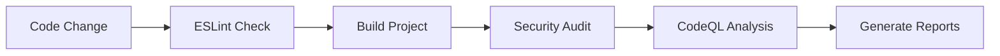
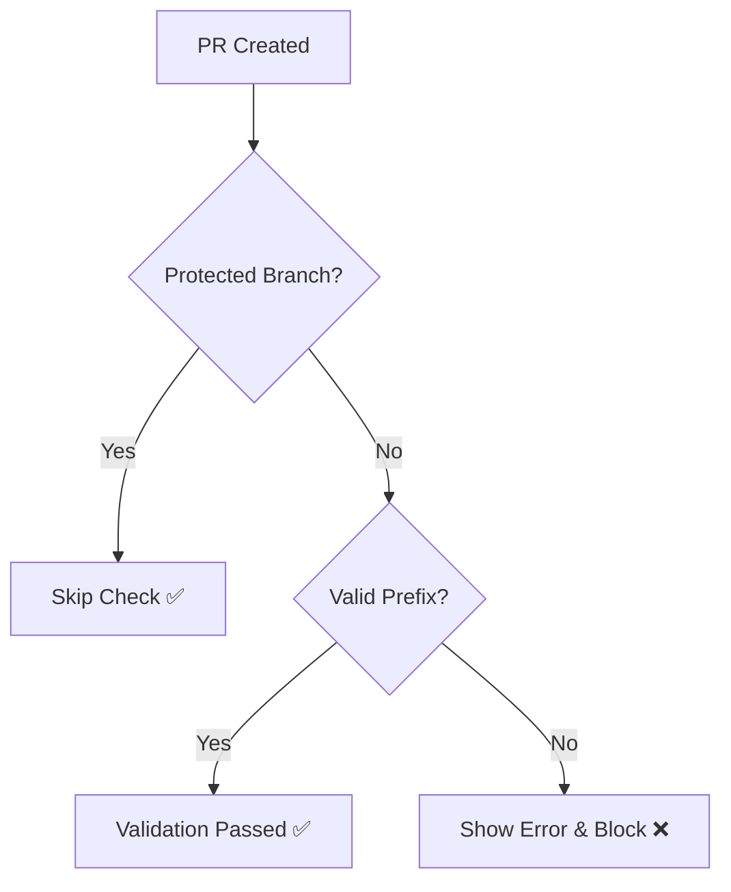
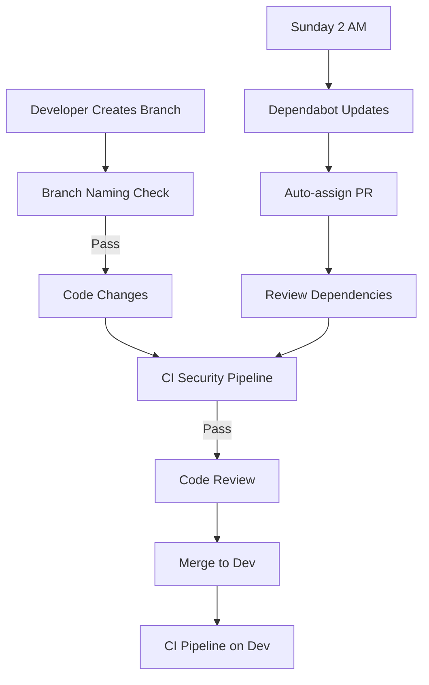

# GitHub Workflows Overview

## 📋 Complete Automation Suite

This repository includes a comprehensive set of GitHub Actions workflows that automate code quality, security, and project management. All workflows are production-ready and optimized for NestJS/TypeScript projects.

## 🎯 Workflow Summary

| Workflow                                                  | Purpose                                   | Triggers                        | Status    |
| --------------------------------------------------------- | ----------------------------------------- | ------------------------------- | --------- |
| [🔒 CI Security Pipeline](#-ci-security-pipeline)         | Code quality, building, security scanning | PR to dev, Push to dev, Monthly | ✅ Active |
| [🌿 Branch Naming Convention](#-branch-naming-convention) | Enforce consistent branch naming          | PR to dev/staging/main          | ✅ Active |
| [🤖 Dependabot](#-dependabot)                             | Automated dependency updates              | Weekly schedule                 | ✅ Active |

## 🔒 CI Security Pipeline

**File:** `.github/workflows/ci-security-pipeline.yml`

### Overview

Comprehensive pipeline that ensures code quality, security, and build integrity on every code change.

### When It Runs

```yaml
Triggers:
- Pull Request → dev branch (with path filtering)
- Push → dev branch
- Monthly schedule (1st day at 2 AM UTC)

Path Filtering:
- **/*.ts, **/*.js, **/*.tsx, **/*.jsx
- package*.json
- prisma/**
```

### What It Does



### Key Features

- **ESLint Validation** - Code quality and style enforcement
- **Build Verification** - Ensures TypeScript compilation success
- **Security Audit** - npm vulnerability scanning
- **CodeQL Analysis** - Advanced security code analysis
- **Smart Optimization** - Conditional steps based on event type

### Security Scanning

- **Languages:** JavaScript/TypeScript
- **Query Sets:**
  - PR: `security-only` (fast feedback)
  - Push/Schedule: `security-extended,security-and-quality` (comprehensive)
- **Integration:** GitHub Security tab, vulnerability alerts

### Performance Optimization

- **Path Filtering** - Only runs on relevant file changes
- **Conditional Steps** - Different logic for PR vs push events
- **Timeout Protection** - 15-minute maximum runtime
- **npm Cache** - Faster dependency installation

### Detailed Documentation

📖 **[Complete CI Security Pipeline Guide](./CI-SECURITY-PIPELINE.md)**

---

## 🌿 Branch Naming Convention

**File:** `.github/workflows/branch-naming.yml`

### Overview

Automatically enforces consistent branch naming standards across the project to improve organization and collaboration.

### When It Runs

```yaml
Triggers:
  - Pull Request opened → dev, staging, main
  - Pull Request synchronized → dev, staging, main
```

### Naming Rules

```bash
✅ Required Prefixes:
- feature/your-feature-name
- fix/your-fix-name
- hotfix/critical-fix
- bugfix/api-validation
- chore/update-dependencies
- docs/api-documentation

🔒 Protected Branches (Exempt):
- main, staging, dev
```

### Validation Process



### Error Handling

When validation fails, developers get:

- ❌ Detailed error message explaining the issue
- 📋 Complete list of allowed prefixes and examples
- 🔧 Exact commands to fix the branch name
- 🚫 PR merge is blocked until fixed

### Benefits

- **Consistency** - Uniform branch names across team
- **Organization** - Easy identification of branch purpose
- **Automation** - No manual review needed
- **Documentation** - Clear error messages guide developers

### Detailed Documentation

📖 **[Complete Branch Naming Guide](./BRANCH-NAMING-WORKFLOW.md)**

---

## 🤖 Dependabot

**File:** `.github/dependabot.yml`

### Overview

Automated dependency management that keeps packages secure and up-to-date while minimizing disruption to development workflow.

### Schedule

```yaml
Frequency: Weekly
Day: Sunday
Time: 02:00 UTC
Open PR Limit: 5 maximum
```

### Update Strategy

```yaml
Development Dependencies:
- Patterns: @types/*, eslint*, prettier*, typescript, jest*
- Updates: Minor + Patch versions
- Grouping: Single PR for related dev tools

Production Dependencies:
- Patterns: All runtime dependencies
- Updates: Patch versions only
- Grouping: Separate PR for production packages
```

### Security Features

- **Automatic Security Updates** - Bypasses normal restrictions for vulnerabilities
- **Vulnerability Alerts** - Integration with GitHub Security tab
- **High Priority** - Security updates get immediate attention
- **Risk Assessment** - Different handling for dev vs production dependencies

### PR Management

- **Auto-Assignment** - Assigns to repository maintainer
- **Commit Format** - Standardized commit messages with `chore:` prefix
- **Grouping Strategy** - Reduces PR noise by bundling related updates
- **Review Process** - Clear categorization for easier review

### Benefits

- **Security** - Automated vulnerability patching
- **Maintenance** - Reduces manual dependency management
- **Stability** - Conservative update strategy for production
- **Efficiency** - Batched updates reduce review overhead

### Detailed Documentation

📖 **[Complete Dependabot Configuration Guide](./DEPENDABOT-CONFIGURATION.md)**

---

## 🔄 Workflow Integration

### How Workflows Work Together



### Event Flow

1. **Developer Workflow**
   - Create feature branch with proper naming
   - Branch naming validation runs automatically
   - Code changes trigger CI security pipeline
   - All checks must pass before merge

2. **Automated Maintenance**
   - Weekly dependency updates via Dependabot
   - Monthly comprehensive security scans
   - Continuous monitoring and alerts

3. **Security Integration**
   - CodeQL results in GitHub Security tab
   - Dependabot alerts for vulnerabilities
   - Automated remediation where possible

## ⚙️ Configuration Management

### Required Permissions

```yaml
Repository Settings Required:
  - Actions: Read/Write (for workflow execution)
  - Security Events: Write (for CodeQL integration)
  - Pull Requests: Write (for status checks)
  - Contents: Read (for code access)
```

### Branch Protection Rules

Recommended settings for optimal workflow integration:

```yaml
dev branch:
  - Require status checks to pass before merging
  - Require branches to be up to date before merging
  - Required status checks:
      - 'Lint, Build & Security Scan'
      - 'Check Branch Name'
  - Restrict pushes that create files in these paths: .github/workflows/
```

### Secrets Management

No additional secrets required - workflows use:

- `GITHUB_TOKEN` (automatically provided)
- Repository permissions for CodeQL and security features

## 📊 Monitoring & Reporting

### Workflow Status

Monitor all workflows at:

```
Repository → Actions → All workflows
```

### Security Reporting

- **Security Tab** - CodeQL findings and vulnerability alerts
- **Dependabot Tab** - Dependency update status and security alerts
- **Actions Tab** - Workflow execution history and logs

### Performance Metrics

Track these key indicators:

- **Build Time** - Average CI pipeline execution duration
- **Success Rate** - Percentage of successful workflow runs
- **Security Response** - Time from vulnerability to fix
- **Update Frequency** - Dependency update merge rate

## 🚨 Troubleshooting

### Common Issues

#### 1. **CI Pipeline Failures**

```bash
# Most common causes:
- ESLint rule violations
- TypeScript compilation errors
- Test failures
- npm audit findings

# Solutions:
npm run lint --fix
npm run test
npm audit fix
```

#### 2. **Branch Naming Failures**

```bash
# Fix branch name:
git branch -m old-name feature/new-name
git push origin -u feature/new-name
git push origin --delete old-name
```

#### 3. **Dependabot Issues**

```bash
# Common issues:
- Conflicting dependency versions
- Failed security updates
- Too many open PRs

# Solutions:
- Review and merge existing PRs
- Manually resolve dependency conflicts
- Temporarily adjust open PR limit
```

#### 4. **CodeQL Timeouts**

```bash
# Solutions:
- Check for large files or complex patterns
- Review query selection strategy
- Contact GitHub support for persistent issues
```

### Debug Commands

```bash
# Test workflows locally (using act):
act -l  # List available workflows
act push  # Simulate push event

# Check workflow syntax:
yamllint .github/workflows/*.yml

# Validate dependencies:
npm audit
npm outdated
npm list --depth=0
```

## 🎯 Best Practices

### For Development Teams

1. **Understand the Flow** - Learn how each workflow affects your development process
2. **Follow Conventions** - Use proper branch naming and commit messages
3. **Monitor Status** - Check workflow results and act on failures promptly
4. **Review Security** - Regularly check security tabs and alerts

### For Repository Maintainers

1. **Keep Workflows Updated** - Regularly update action versions
2. **Monitor Performance** - Track workflow execution times and success rates
3. **Review Security** - Act promptly on security findings
4. **Document Changes** - Update documentation when modifying workflows

### For Security

1. **Enable Alerts** - Configure GitHub to send security notifications
2. **Review Dependencies** - Regularly audit dependency updates
3. **Respond Quickly** - Handle high-severity security updates immediately
4. **Understand Reports** - Learn to interpret CodeQL and audit results

## 🔧 Customization Guide

### Adding New Workflows

1. Create `.github/workflows/new-workflow.yml`
2. Use existing workflows as templates
3. Test thoroughly before merging
4. Update this documentation

### Modifying Existing Workflows

1. Test changes in a feature branch
2. Monitor execution on test PRs
3. Update related documentation
4. Consider backward compatibility

### Integration with External Tools

- **Slack/Teams** - Add notification steps
- **Jira/Linear** - Integrate with issue tracking
- **Deployment** - Add deployment automation
- **Monitoring** - Connect with monitoring tools

## 📚 Additional Resources

### GitHub Actions Documentation

- [GitHub Actions Documentation](https://docs.github.com/en/actions)
- [CodeQL Documentation](https://docs.github.com/en/code-security/code-scanning)
- [Dependabot Documentation](https://docs.github.com/en/code-security/dependabot)

### Workflow-Specific Guides

- 📖 [CI Security Pipeline Details](./CI-SECURITY-PIPELINE.md)
- 📖 [Branch Naming Convention Details](./BRANCH-NAMING-WORKFLOW.md)
- 📖 [Dependabot Configuration Details](./DEPENDABOT-CONFIGURATION.md)
- 📖 [Local CI Setup Guide](./LOCAL-CI-SETUP.md)

This comprehensive automation suite ensures your NestJS project maintains high quality, security, and consistency throughout its development lifecycle! 🚀
